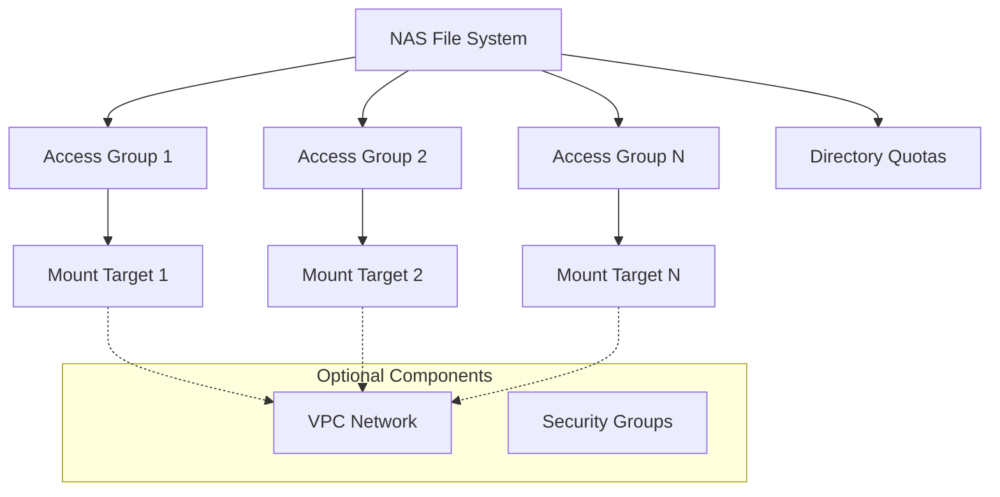

# Terraform Alibaba CloudStack NAS File System Module

## Overview

This module manages Alibaba CloudStack NAS (Network Attached Storage) file systems with comprehensive features including multiple access groups, mount targets, and directory quotas.

## Features

- ✅ Automatic NAS file system creation with auto-detected protocols and storage types
- ✅ Support for existing file system integration via ID
- ✅ Multiple access group management with automatic VPC/Classic detection
- ✅ Dynamic mount target creation for each access group
- ✅ Directory quota management with flexible quota configurations
- ✅ Automatic zone and cluster selection
- ✅ Comprehensive variable validation and defaults

## Architecture



## Usage Examples

### Basic Usage - New File System

```hcl
module "nas_basic" {
  source      = "./modules/nas_file_system"
  description = "My basic NAS file system"
  
  mounts = [
    {
      access_group_name = "web-servers"
      vswitch_id        = "vsw-12345"
    }
  ]
}
```

### Advanced Usage - Multiple Access Groups

```hcl
module "nas_advanced" {
  source      = "./modules/nas_file_system"
  description = "Production NAS with multiple access groups"
  
  # Multiple access groups for different environments
  mounts = [
    {
      access_group_name = "web-servers-prod"
      vswitch_id        = "vsw-web-prod"
    },
    {
      access_group_name = "app-servers-staging"
      vswitch_id        = "vsw-app-staging"
    },
    {
      access_group_name = "db-backup-dev"
      vswitch_id        = "vsw-db-dev"
    }
  ]
  
  # Directory quota configuration
  quota_path = "/"
  quotas = [
    {
      quota_type       = "USER"
      user_type        = "USER_ID"
      user_id          = "1001"
      size_limit       = 107374182400  # 100GB
      file_count_limit = 1000000
    },
    {
      quota_type       = "GROUP"
      user_type        = "GROUP_ID"
      user_id          = "1002"
      size_limit       = 53687091200   # 50GB
    }
  ]
}
```

### Using Existing File System

```hcl
# First create a file system
resource "alibabacloudstack_nas_file_system" "existing" {
  protocol_type = "NFS"
  storage_type  = "standard"
  zone_id       = "cn-hangzhou-a"
  cluster_id    = "cluster-123"
  description   = "Pre-created NAS"
}

# Then use it with the module
module "nas_existing" {
  source             = "./modules/nas_file_system"
  description        = "Using existing NAS"
  nas_file_system_id = alibabacloudstack_nas_file_system.existing.id
  
  mounts = [
    {
      access_group_name = "legacy-apps"
      vswitch_id        = "vsw-legacy"
    }
  ]
  
  # Add quotas to existing file system
  quota_path = "/shared"
  quotas = [
    {
      quota_type       = "USER"
      user_type        = "USER_ID"
      user_id          = "2001"
      size_limit       = 21474836480   # 20GB
    }
  ]
}
```

## Variables

| Name | Description | Type | Default | Required |
|------|-------------|------|---------|----------|
| `protocol_type` | File transfer protocol type (NFS/SMB) | `string` | `""` (auto-detected) | No |
| `storage_type` | Storage type (standard/performance) | `string` | `""` (auto-detected) | No |
| `description` | File system description | `string` | n/a | Yes |
| `mounts` | List of access group configurations | `list(object)` | `[]` | No |
| `quota_path` | Path for directory quota | `string` | `"/"` | No |
| `quotas` | List of quota configurations | `list(object)` | `[]` | No |
| `nas_file_system_id` | Existing file system ID | `string` | `""` | No |

### Mounts Object Structure

```hcl
{
  access_group_name = string  # Unique name for access group
  vswitch_id        = string  # VSwitch ID for VPC access (empty for Classic)
}
```

### Quotas Object Structure

```hcl
{
  quota_type       = string  # USER or GROUP
  user_type        = string  # USER_ID or GROUP_ID
  user_id          = string  # User/group identifier
  size_limit       = number  # Size limit in bytes (optional)
  file_count_limit = number  # File count limit (optional)
}
```

## Outputs

| Name | Description |
|------|-------------|
| `file_system_id` | The ID of the created or existing file system |
| `access_group_ids` | Map of access group names to their IDs |
| `mount_target_domains` | Map of access group names to mount target domains |
| `quota_enabled` | Boolean indicating if quotas are configured |

## Requirements

| Name | Version |
|------|---------|
| terraform | >= 1.0 |
| alibabacloudstack provider | >= 1.0 |

## Providers

- `alibabacloudstack` - Used for all NAS resources

## Resources Created

1. **Data Sources**:
   - `alibabacloudstack_nas_zones` - Gets available NAS zones and protocols
   - `alibabacloudstack_nas_file_systems` - Validates existing file system

2. **Resources**:
   - `alibabacloudstack_nas_file_system` - Creates new file system (conditional)
   - `alibabacloudstack_nas_accessgroup` - Creates access groups (multiple)
   - `alibabacloudstack_nas_mounttarget` - Creates mount targets (multiple)
   - `alibabacloudstack_nas_dir_quota` - Configures directory quotas (conditional)

## Best Practices

### 1. Access Group Management
```hcl
# Use descriptive names for better management
mounts = [
  {
    access_group_name = "k8s-worker-nodes"
    vswitch_id        = var.worker_vswitch_id
  },
  {
    access_group_name = "jenkins-agents"
    vswitch_id        = var.ci_vswitch_id
  }
]
```

### 2. Quota Configuration
```hcl
# Set reasonable limits based on use case
quotas = [
  {
    quota_type       = "USER"
    user_type        = "USER_ID"
    user_id          = "1001"
    size_limit       = 107374182400   # 100GB - suitable for application logs
    file_count_limit = 1000000        # 1M files
  }
]
```

### 3. Multi-environment Setup
```hcl
# Use variables for environment-specific configurations
locals {
  env_configs = {
    dev = {
      mounts = [{...}]
      quotas = [{...}]
    }
    prod = {
      mounts = [{...}]
      quotas = [{...}]
    }
  }
}

module "nas_${var.environment}" {
  source = "./modules/nas_file_system"
  # ... other variables
  mounts = local.env_configs[var.environment].mounts
  quotas = local.env_configs[var.environment].quotas
}
```

## Troubleshooting

### Common Issues

1. **Access Group Creation Failures**
   ```bash
   # Error: Invalid access group name
   # Solution: Ensure names are unique and follow naming conventions
   ```

2. **Mount Target Issues**
   ```bash
   # Error: VSwitch not found
   # Solution: Verify VSwitch ID exists and is in correct zone
   ```

3. **Quota Configuration Problems**
   ```bash
   # Error: Invalid quota limits
   # Solution: Check size limits are within allowed ranges
   ```

### Debug Commands

```bash
# Validate configuration
terraform validate

# Plan without applying
terraform plan -out=tfplan

# Check specific resource
terraform state show module.nas_file_system.alibabacloudstack_nas_file_system.default
```

## Testing

The module includes automated tests in the `tests/` directory covering:
- Basic file system creation
- Multiple access group scenarios
- Quota configuration validation
- Existing file system integration

Run tests using:
```bash
cd tests/
terraform init
terraform apply -auto-approve
```

## Contributing

1. Fork the repository
2. Create feature branch
3. Add/update tests
4. Update documentation
5. Submit pull request

## License

MIT License - see LICENSE file for details.

## Support

For issues and questions:
- Open GitHub issues
- Check existing documentation
- Review example configurations