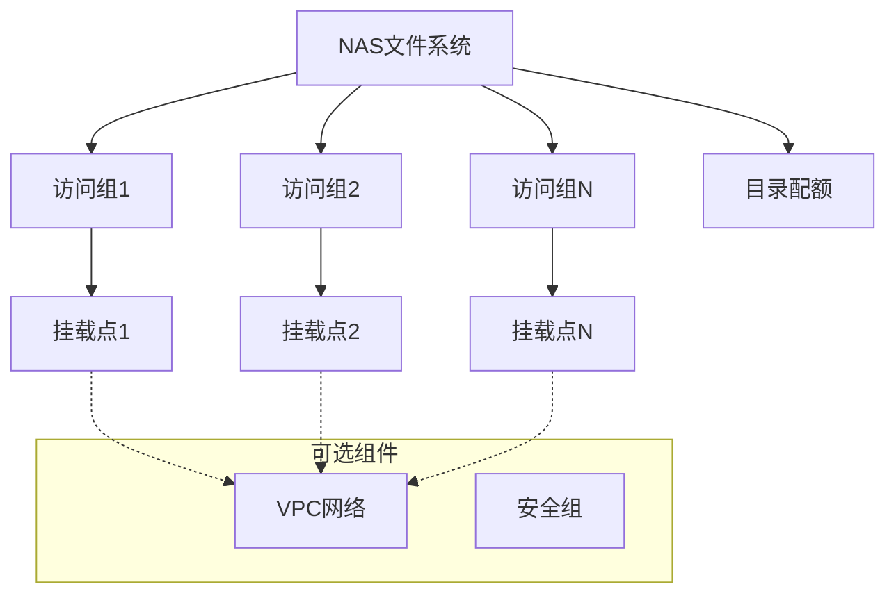

# Terraform Alibaba CloudStack NAS 文件系统模块

## 概述

该模块管理阿里云CloudStack NAS（网络附加存储）文件系统，具有包括多个访问组、挂载点和目录配额在内的全面功能。

## 功能特性

- ✅ 自动创建NAS文件系统，支持协议和存储类型自动检测
- ✅ 支持通过ID集成现有文件系统
- ✅ 多访问组管理，支持自动VPC/经典网络检测
- ✅ 为每个访问组动态创建挂载点
- ✅ 目录配额管理，支持灵活的配额配置
- ✅ 自动区域和集群选择
- ✅ 全面的变量验证和默认值设置

## 架构设计



## 使用示例

### 基础用法 - 新建文件系统

```hcl
module "nas_basic" {
  source      = "./modules/nas_file_system"
  description = "我的基础NAS文件系统"
  
  mounts = [
    {
      access_group_name = "web-servers"
      vswitch_id        = "vsw-12345"
    }
  ]
}
```

### 高级用法 - 多访问组

```hcl
module "nas_advanced" {
  source      = "./modules/nas_file_system"
  description = "生产环境NAS多访问组配置"
  
  # 多个访问组用于不同环境
  mounts = [
    {
      access_group_name = "web-servers-prod"
      vswitch_id        = "vsw-web-prod"
    },
    {
      access_group_name = "app-servers-staging"
      vswitch_id        = "vsw-app-staging"
    },
    {
      access_group_name = "db-backup-dev"
      vswitch_id        = "vsw-db-dev"
    }
  ]
  
  # 目录配额配置
  quota_path = "/"
  quotas = [
    {
      quota_type       = "USER"
      user_type        = "USER_ID"
      user_id          = "1001"
      size_limit       = 107374182400  # 100GB
      file_count_limit = 1000000
    },
    {
      quota_type       = "GROUP"
      user_type        = "GROUP_ID"
      user_id          = "1002"
      size_limit       = 53687091200   # 50GB
    }
  ]
}
```

### 使用现有文件系统

```hcl
# 首先创建文件系统
resource "alibabacloudstack_nas_file_system" "existing" {
  protocol_type = "NFS"
  storage_type  = "standard"
  zone_id       = "cn-hangzhou-a"
  cluster_id    = "cluster-123"
  description   = "预创建的NAS"
}

# 然后在模块中使用
module "nas_existing" {
  source             = "./modules/nas_file_system"
  description        = "使用现有NAS"
  nas_file_system_id = alibabacloudstack_nas_file_system.existing.id
  
  mounts = [
    {
      access_group_name = "legacy-apps"
      vswitch_id        = "vsw-legacy"
    }
  ]
  
  # 为现有文件系统添加配额
  quota_path = "/shared"
  quotas = [
    {
      quota_type       = "USER"
      user_type        = "USER_ID"
      user_id          = "2001"
      size_limit       = 21474836480   # 20GB
    }
  ]
}
```

## 变量说明

| 名称 | 描述 | 类型 | 默认值 | 必需 |
|------|------|------|--------|------|
| `protocol_type` | 文件传输协议类型(NFS/SMB) | `string` | `""` (自动检测) | 否 |
| `storage_type` | 存储类型(standard/performance) | `string` | `""` (自动检测) | 否 |
| `description` | 文件系统描述 | `string` | n/a | 是 |
| `mounts` | 访问组配置列表 | `list(object)` | `[]` | 否 |
| `quota_path` | 目录配额路径 | `string` | `"/"` | 否 |
| `quotas` | 配额配置列表 | `list(object)` | `[]` | 否 |
| `nas_file_system_id` | 现有文件系统ID | `string` | `""` | 否 |

### Mounts 对象结构

```hcl
{
  access_group_name = string  # 访问组唯一名称
  vswitch_id        = string  # VPC访问的VSwitch ID (为空表示经典网络)
}
```

### Quotas 对象结构

```hcl
{
  quota_type       = string  # USER 或 GROUP
  user_type        = string  # USER_ID 或 GROUP_ID
  user_id          = string  # 用户/组标识符
  size_limit       = number  # 大小限制(字节) (可选)
  file_count_limit = number  # 文件数量限制 (可选)
}
```

## 输出变量

| 名称 | 描述 |
|------|------|
| `file_system_id` | 创建或现有文件系统的ID |
| `access_group_ids` | 访问组名称到ID的映射 |
| `mount_target_domains` | 访问组名称到挂载目标域名的映射 |
| `quota_enabled` | 指示是否配置了配额的布尔值 |

## 环境要求

| 名称 | 版本 |
|------|------|
| terraform | >= 1.0 |
| alibabacloudstack provider | >= 1.0 |

## 使用的Provider

- `alibabacloudstack` - 用于所有NAS资源

## 创建的资源

1. **数据源**:
   - `alibabacloudstack_nas_zones` - 获取可用的NAS区域和协议
   - `alibabacloudstack_nas_file_systems` - 验证现有文件系统

2. **资源**:
   - `alibabacloudstack_nas_file_system` - 创建新文件系统(条件性)
   - `alibabacloudstack_nas_accessgroup` - 创建访问组(多个)
   - `alibabacloudstack_nas_mounttarget` - 创建挂载点(多个)
   - `alibabacloudstack_nas_dir_quota` - 配置目录配额(条件性)

## 最佳实践

### 1. 访问组管理
```hcl
# 使用描述性名称便于管理
mounts = [
  {
    access_group_name = "k8s-worker-nodes"
    vswitch_id        = var.worker_vswitch_id
  },
  {
    access_group_name = "jenkins-agents"
    vswitch_id        = var.ci_vswitch_id
  }
]
```

### 2. 配额配置
```hcl
# 根据使用场景设置合理的限制
quotas = [
  {
    quota_type       = "USER"
    user_type        = "USER_ID"
    user_id          = "1001"
    size_limit       = 107374182400   # 100GB - 适合应用日志
    file_count_limit = 1000000        # 100万文件
  }
]
```

### 3. 多环境配置
```hcl
# 使用变量处理环境特定配置
locals {
  env_configs = {
    dev = {
      mounts = [{...}]
      quotas = [{...}]
    }
    prod = {
      mounts = [{...}]
      quotas = [{...}]
    }
  }
}

module "nas_${var.environment}" {
  source = "./modules/nas_file_system"
  # ... 其他变量
  mounts = local.env_configs[var.environment].mounts
  quotas = local.env_configs[var.environment].quotas
}
```

## 故障排除

### 常见问题

1. **访问组创建失败**
   ```bash
   # 错误: 无效的访问组名称
   # 解决方案: 确保名称唯一且符合命名规范
   ```

2. **挂载点问题**
   ```bash
   # 错误: 找不到VSwitch
   # 解决方案: 验证VSwitch ID存在且在正确区域
   ```

3. **配额配置问题**
   ```bash
   # 错误: 无效的配额限制
   # 解决方案: 检查大小限制在允许范围内
   ```

### 调试命令

```bash
# 验证配置
terraform validate

# 规划但不应用
terraform plan -out=tfplan

# 检查特定资源
terraform state show module.nas_file_system.alibabacloudstack_nas_file_system.default
```

## 测试

模块在`tests/`目录中包含自动化测试，涵盖:
- 基础文件系统创建
- 多访问组场景
- 配额配置验证
- 现有文件系统集成

运行测试:
```bash
cd tests/
terraform init
terraform apply -auto-approve
```

## 贡献指南

1. Fork仓库
2. 创建功能分支
3. 添加/更新测试
4. 更新文档
5. 提交Pull Request

## 许可证

MIT许可证 - 详情请参见LICENSE文件。

## 技术支持

如有问题和疑问:
- 提交GitHub issues
- 查看现有文档
- 审查示例配置